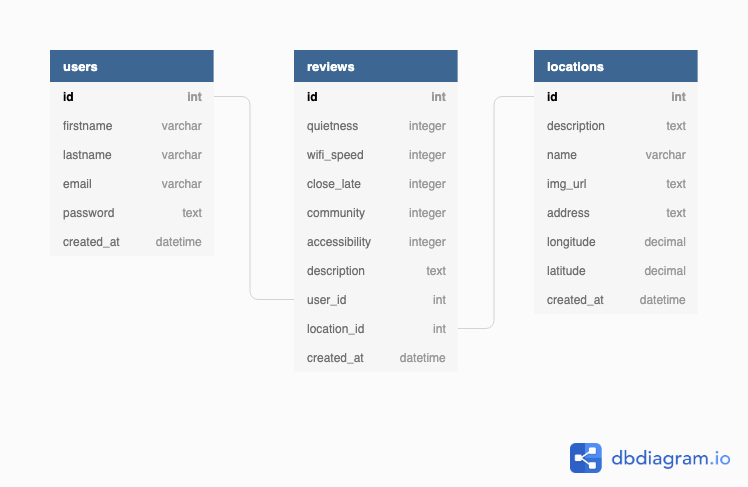

# WhereToCode [](https://travis-ci.org/where-to-code/wtc-backend) [](https://coveralls.io/github/where-to-code/wtc-backend?branch=master)

### About
Finding out details about public places to work can be tedious. WhereToCode enables you to get the information you need, and only that information, to work and code on the go.

### Features
 - Clear information on each location for people to determine if it will work
 - New spaces are easy to make
 - Locations with most use/activity/rating show up first

## WhereToCode Backend 

## Application links
### [API Link](https://where2code.herokuapp.com/api/) 
### [Trello board](https://trello.com/b/m8ODKAUQ/where-to-code)


## Getting Started
### NPM Scripts

To get the server running locally:

- Clone this repo
- **npm install** to install all required dependencies
- **npm run server** to start the local server
- **npm test** to start server using testing environment
- **npm run watch** to start the test in watch mode
- **npm run migrate** to migrate the tables
- **npm run seed** to seed the tables
- **npm run rollback** to rollback all tables
- **npm run reset-db** to rollback, migrate and seed the tables at a go

## Technologies

[NodeJS]() -  is a JavaScript runtime built on Chrome's V8 JavaScript engine.

The [**Express.js**](https://expressjs.com/ ) backend framework was used to build the server. Fast, unopinionated, minimalist web framework for Node.js

#### Why Express.js

- Express is fast.
- Express is efficient.
- Express is scalable.
- Express is a lightweight framework.

## Supporting Packages
Linter
 - [ESLint](https://eslint.org/) - The pluggable linting utility for JavaScript and JSX

Test Tools
 - [Jest](https://jestjs.io/) -  Jest is a delightful JavaScript Testing Framework with a focus on simplicity.
 - [Supertest](https://github.com/visionmedia/supertest)
 - 

## API Documentation

The API endpoints for the server is on Heroku and can be found [here.](https://where2code.herokuapp.com/api/)


#### Location Routes

| Method | Endpoint                 | Access Control | Description                         |
| ------ | ------------------------ | -------------- | ----------------------------------- |
| GET    | `/locations`             | all users      | Returns the locations around a user |
| GET    | `/locations/:locationId` | all users      | Returns a single location           |
| POST   | `/locations/`           | authed user    | Returns the recent posted location           |


#### User Routes
| Method | Endpoint           | Access Control      | Description                          |
| ------ | ------------------ | ------------------- | ------------------------------------ |
| POST   | `/auth/login`      | all users           | Returns info for the logged in user. |
| POST   | `/auth/register`   | all users           | Adds a user to the database.         |
| GET    | `/users/:userId`   | owners, supervisors | Returns info for a single user.      |
| POST   | `/users/register/` | none                | Creates a new user                   |
| PUT    | `/users/:userId`   | owners, supervisors |                                      |
| DELETE | `/users/:userId`   | owners, supervisors |                                      |

#### Data Model



#### 2️⃣ USERS

---

```javascript
{
  id int [primary key]
  firstname varchar
  lastname varchar
  email varchar [unique]
  password text
  created_at datetime [default: `now()`]
}
```

#### LOCATION SCHEMA

|   Fields    |    Data type     |                      Metadata                       |
| :---------: | :--------------: | :-------------------------------------------------: |
|     id      | unsigned integer | primary key, auto-increments, generated by database |
|    name     |      string      |        required, maximum of 100 characters.         |
| description |       text       |                      required                       |
|  image_url  |      string      |        required, maximum of 250 characters.         |
|   address   |      string      |        required, maximum of 250 characters.         |
|  longitude  |      string      |         required, maximum of 30 characters.         |
|  latitude   |      string      |         required, maximum of 30 characters.         |
| created_at  |    timestamp     |                generated by database                |

#### REVIEWS


|   Fields    |    Data type     |                      Metadata                       |
| :---------: | :--------------: | :-------------------------------------------------: |
|     id      | unsigned integer | primary key, auto-increments, generated by database |
|  quietness  |      string      |        required, maximum of 100 characters.         |
| wifi_speed  |       text       |                      required                       |
| close_late  |      string      |        required, maximum of 250 characters.         |
| community   |      string      |        required, maximum of 250 characters.         |
|accessibility|      string      |         required, maximum of 30 characters.         |
| description |      string      |         required, maximum of 30 characters.         |
|  user_id    |      string      |         required                                    |
| location_id |      string      |         required                                    |
| created_at  |    timestamp     |         generated by database                |

---

```javascript
{
  id int [pk]
  quietness integer
  wifi_speed integer
  close_late integer
  community integer
  accessibility integer
  review text
  user_id int [ref: > users.id]
  location_id int [ref: > locations.id]
  created_at datetime [default: `now()`]
}
```

## 2️⃣ Actions

### Get locations close to a user [GET]

**URL**: _https://where2code.herokuapp.com/api/locations?lat=-12.06&long=-77.01_

**Returns**: A an array of locations close to the user.

```javascript
{
    "status": 201,
    "data": [
        {
            "id": 2015,
            "name": "Minka",
            "description": "A Starbucks shop to work out from",
            "image_url": "https://encrypted-tbn0.gstatic.com/images?q=tbn:ANd9GcQN7aBKuIsNaZaqBosrlp3oz3ziEmI2dhtzTdijGrcmwWIYSBQs",
            "address": "Av. Argentina 3093 Minka, Callao, Callao - Lima, LIM",
            "longitude": "-77.11",
            "latitude": "-12.05",
            "created_at": "2019-08-21T11:29:28.714Z"
        },
        {
            "id": 2016,
            "name": "Isil",
            "description": "A Starbucks shop to work out from",
            "image_url": "https://encrypted-tbn0.gstatic.com/images?q=tbn:ANd9GcQbifgcp_29eEnE5BozbdrZweuFHtvN-sJRsooOtmBrDAQqHSDW",
            "address": "Av. Benavides 778, Miraflores, Lima, LIM",
            "longitude": "-77.04",
            "latitude": "-12.11",
            "created_at": "2019-08-21T11:29:28.714Z"
        },
        {
            "id": 2017,
            "name": "Real Plaza Centro Cívico I",
            "description": "A Starbucks shop to work out from",
            "image_url": "http://thespaces.com/wp-content/uploads/2017/02/Primary-Co-Working-NYC.jpg",
            "address": "Real Plaza Centro Cívico, Av. Paseo de, Lima Cercado, Lima",
            "longitude": "-77.04",
            "latitude": "-12.06",
            "created_at": "2019-08-21T11:29:28.714Z"
        }
    ]
}
```

### Get a single location [GET]

**URL**: _https://where2code.herokuapp.com/api/locations/234_

**Returns**: A an array of locations close to the user.

```javascript
{
    "status": 200,
    "data": {
        "id": 234,
        "name": "Safeway - Thompson #623",
        "description": "A Starbucks shop to work out from",
        "image_url": "https://encrypted-tbn0.gstatic.com/images?q=tbn:ANd9GcQbifgcp_29eEnE5BozbdrZweuFHtvN-sJRsooOtmBrDAQqHSDW",
        "address": "300 Mystery Lake Rd, Thompson, MB, CA",
        "longitude": "-97.85",
        "latitude": "55.74",
        "created_at": "2019-08-21T11:29:28.714Z",
        "averageRating": 3,
        "reviews": [
            {
                "id": 1,
                "quietness": 4,
                "wifi_speed": 5,
                "close_late": 3,
                "community": 5,
                "accessibility": 3,
                "description": "I have the best experience with this place and everything is very perfect, corporative and also the main thing is the environment that is very interesting. I have worked for the best assignment writing services in this place so this is my personal experience.",
                "user_id": 4
            },
            {
                "id": 2,
                "quietness": 3,
                "wifi_speed": 3,
                "close_late": 2,
                "community": 4,
                "accessibility": 2,
                "description": "We as a professional thesis writer always need that kind of environment to work and spend some quality time with the other fellows, So thank you for providing us a great place to sit on and the way they facilitate it is one of the best place for freelancers who need space for their work.",
                "user_id": 3
            },
            {
                "id": 3,
                "quietness": 3,
                "wifi_speed": 2,
                "close_late": 1,
                "community": 1,
                "accessibility": 4,
                "description": "This hotel is awesome! It was superb and clean! Incredible staff and Can You Do My Homework - DoMyAssignmentForMe accommodating to us. We will visit and remain at this inn many occasions over. So cheerful to have discovered this gem in the ideal area!",
                "user_id": 3
            },
            {
                "id": 4,
                "quietness": 1,
                "wifi_speed": 2,
                "close_late": 3,
                "community": 5,
                "accessibility": 2,
                "description": "We had a rough time at the Yard Flatiron North. While we were there the air conditioning was broken multiple times, as was the elevator. In addition, they allow companies to run public facing businesses out their space, so anyone can just be wandering around the space unattended. Lastly, all of the doors are unlocked during business hours so anyone from the street can just come up to each floor and use the bathroom or kitchen. Women at front desk were nice, but lack of investment and systems meant the overall experience was pretty bad.",
                "user_id": 4
            },
            {
                "id": 5,
                "quietness": 2,
                "wifi_speed": 1,
                "close_late": 2,
                "community": 2,
                "accessibility": 3,
                "description": "We as a professional thesis writer always need that kind of environment to work and spend some quality time with the other fellows, So thank you for providing us a great place to sit on and the way they facilitate it is one of the best place for freelancers who need space for their work.",
                "user_id": 3
            }
        ]
    }
}
```

### Add new location [POST]

**URL**: _https://where2code.herokuapp.com/api/locations/_

**Returns**: An object of a created location.

Input
```
{
	"name":"Somewhere on Mars",
	"description":"What for ?",
	"image_url":"www.badass?ORkickass.com",
	"address":"127.0.0.1 localhost",
	"longitude":"24.1",
	"latitude":"34.5"
}
```
Returns
```
{
    "status": 201,
    "data": [
        {
            "id": 5010,
            "name": "Somewhere on Earth",
            "description": "What for ?",
            "image_url": "www.badass?ORkickass.com",
            "address": "127.0.0.1 localhost",
            "longitude": "24.1",
            "latitude": "34.5",
            "created_at": "2019-09-10T08:38:32.376Z"
        }
    ]
}
```

## 3️⃣ Environment Variables

In order for the app to function correctly, the user must set up their own environment variables.

create a .env file that includes the following:

- PORT - The port the server will start on functionality not available in SQLite
- DB_ENV - The database the server will run on.
- DB_URL - The PostgreSQL database url.
- DB_TEST_URL - The test url.

## Contributing

When contributing to this repository, please first discuss the change you wish to make via issue, email, or any other method with the owners of this repository before making a change.

Please note we have a [code of conduct](./code_of_conduct.md). Please follow it in all your interactions with the project.

### Issue/Bug Request

**If you are having an issue with the existing project code, please submit a bug report under the following guidelines:**

- Check first to see if your issue has already been reported.
- Check to see if the issue has recently been fixed by attempting to reproduce the issue using the latest master branch in the repository.
- Create a live example of the problem.
- Submit a detailed bug report including your environment & browser, steps to reproduce the issue, actual and expected outcomes, where you believe the issue is originating from, and any potential solutions you have considered.

### Feature Requests

We would love to hear from you about new features which would improve this app and further the aims of our project. Please provide as much detail and information as possible to show us why you think your new feature should be implemented.

### Pull Requests

If you have developed a patch, bug fix, or new feature that would improve this app, please submit a pull request. It is best to communicate your ideas with the developers first before investing a great deal of time into a pull request to ensure that it will mesh smoothly with the project.

Remember that this project is licensed under the MIT license, and by submitting a pull request, you agree that your work will be, too.

#### Pull Request Guidelines

- Ensure any install or build dependencies are removed before the end of the layer when doing a build.
- Update the README.md with details of changes to the interface, including new plist variables, exposed ports, useful file locations and container parameters.
- Ensure that your code conforms to our existing code conventions and test coverage.
- Include the relevant issue number, if applicable.
- You may merge the Pull Request in once you have the sign-off of two other developers, or if you do not have permission to do that, you may request the second reviewer to merge it for you.

### Attribution

These contribution guidelines have been adapted from [this good-Contributing.md-template](https://gist.github.com/PurpleBooth/b24679402957c63ec426).

## Documentation

See [Frontend Documentation](https://github.com/where-to-code/wtc-frontend) for details on the frontend of our project.